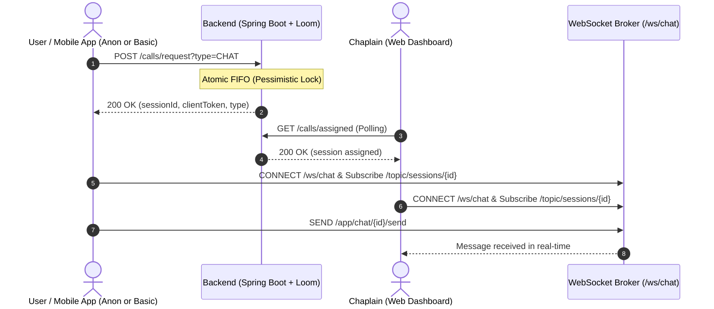

# CapellanAPP Backend: Frontend & Mobile Integration Guide

> **Architecture Note:** All REST endpoints operate over HTTP/JSON with standard status codes. Real-time written chat runs over **STOMP via WebSockets** powered by **Java 21 Virtual Threads (Project Loom)** for ultra-low latency and scalable concurrency.

---

## 1. Global Conventions & Base URLs

### Base URLs
* **REST API:** `http://localhost:8080` (or your staging/production domain, e.g. `https://api.yourdomain.com`)
* **WebSocket (STOMP):** `ws://localhost:8080/ws/chat` (or `http://localhost:8080/ws/chat` with SockJS)

### Headers
| Header | Description | Required |
| :--- | :--- | :--- |
| `Content-Type` | `application/json` | On all `POST` / `PATCH` / `PUT` requests |
| `Authorization` | `Bearer <token>` | For logged-in users (BASIC, CHAPLAIN, SUPERUSER) |
| `X-Client-Token` | `<clientToken-uuid>` | For anonymous/guest sessions and fallback reconnection |

### Rate Limiting (Anti-Abuso)
* Public/anonymous endpoints (`/calls/request`, `/calls/{id}/reconnect`, `/prayers`) allow **10 requests per minute per IP**.
* When exceeded, the backend returns:
  ```json
  // HTTP 429 Too Many Requests
  {
    "error": "Rate limit exceeded (10 requests per minute). Please wait before trying again."
  }
  ```

---

## 2. Authentication

### 2.1 Login
* **Method & Path:** `POST /auth/login`
* **Access:** Public (No token required)
* **Request Body:**
  ```json
  {
    "username": "chaplain_juan",
    "password": "SecurePassword123!"
  }
  ```
* **Response (200 OK):**
  ```json
  {
    "token": "4f18d7bc-7d84-4861-bf96-90cb895eb487",
    "role": "CHAPLAIN" // Roles: "BASIC", "CHAPLAIN", "CHAPLAIN_LEADER", "SUPERUSER"
  }
  ```

### 2.2 Get Current User Identity (`/auth/me`)
* **Method & Path:** `GET /auth/me`
* **Headers:** `Authorization: Bearer <token>`
* **Response (200 OK):**
  ```json
  {
    "id": 15,
    "role": "CHAPLAIN",
    "username": "chaplain_juan"
  }
  ```

---

## 3. Pastoral Sessions: Video & Written Chat



---

### 3.1 Request Pastoral Session (Video or Chat)
* **Method & Path:** `POST /calls/request?type={VIDEO|CHAT}`
* **Query Params:**
  * `type`: `VIDEO` (default) or `CHAT`
* **Access:** **Public.** Works for both authenticated `BASIC` users (with `Authorization: Bearer <token>`) and **100% anonymous guests** (no header required).
* **Response (200 OK):**
  ```json
  {
    "sessionId": 104,
    "sessionType": "CHAT",       // or "VIDEO"
    "livekitRoomName": "chat-e4b2d35c-1123-4556-a192-384729103847", // null if CHAT and LiveKit not used
    "token": null,               // LiveKit JWT token if type is VIDEO; null if CHAT
    "clientToken": "a1b2c3d4-e5f6-7890-1234-567890abcdef" // SAVE THIS! Essential for WS & Reconnection
  }
  ```

> [!IMPORTANT]
> **Mobile / Frontend Rule:** Store the `sessionId` and `clientToken` immediately in local storage / secure storage. This `clientToken` is your credentials if the user loses Wi-Fi or mobile data.

---

### 3.2 Poll Assigned Session (Chaplains only)
* **Method & Path:** `GET /calls/assigned`
* **Headers:** `Authorization: Bearer <chaplain_token>`
* **Response (200 OK - Session Found):**
  ```json
  {
    "sessionId": 104,
    "sessionType": "CHAT",
    "livekitRoomName": "chat-e4b2d35c-1123-4556-a192-384729103847",
    "token": null, // or LiveKit JWT if VIDEO
    "clientToken": "a1b2c3d4-e5f6-7890-1234-567890abcdef"
  }
  ```
* **Response (204 No Content):** No user in queue waiting for this chaplain.

---

### 3.3 Reconnection Fallback (Network / Wi-Fi Drop)
If the user's connection drops, the chaplain stays reserved in `IN_CHAT` or `IN_CALL` for a **5-minute grace period**. When the client detects network restoration, call this endpoint to resume.

* **Method & Path:** `POST /calls/{id}/reconnect`
* **Headers (either header or query param):**
  * `X-Client-Token: <clientToken>`
  * OR `?clientToken=<clientToken>`
* **Response (200 OK):**
  ```json
  {
    "sessionId": 104,
    "sessionType": "CHAT",
    "livekitRoomName": "chat-e4b2d35c-1123-4556-a192-384729103847",
    "token": null, // renewed LiveKit token if VIDEO
    "clientToken": "a1b2c3d4-e5f6-7890-1234-567890abcdef"
  }
  ```
* **Error Response (409 Conflict):** If the 5 minutes expired:
  ```json
  {
    "error": "Reconnection grace period (5 minutes) expired"
  }
  ```

---

### 3.4 Session Heartbeat (Periodic Ping)
Send this every 30-45 seconds to keep the session active and reset the disconnection timer.

* **Method & Path:** `POST /calls/{id}/heartbeat`
* **Headers:** `X-Client-Token: <clientToken>`
* **Response:** `200 OK` (empty body)

---

### 3.5 Retrieve Chat History
Call this when entering a chat room or immediately after a reconnect to recover all previous messages.

* **Method & Path:** `GET /calls/{id}/messages`
* **Headers:** `X-Client-Token: <clientToken>` (or `Authorization: Bearer <token>`)
* **Response (200 OK):**
  ```json
  [
    {
      "id": 1,
      "sessionId": 104,
      "senderRole": "GUEST",
      "senderName": "Anónimo",
      "content": "Hola, necesito hablar con alguien por favor.",
      "clientToken": null,
      "timestamp": "2026-09-04T18:00:10.123Z"
    },
    {
      "id": 2,
      "sessionId": 104,
      "senderRole": "CHAPLAIN",
      "senderName": "Capellán Pedro",
      "content": "Hola hermano, acá estoy para escucharte. ¿Cómo te sentís?",
      "clientToken": null,
      "timestamp": "2026-09-04T18:00:35.456Z"
    }
  ]
  ```

---

### 3.6 End Session
* **Method & Path:** `POST /calls/{id}/end`
* **Headers:** `X-Client-Token: <clientToken>` (or `Authorization: Bearer <token>`)
* **Response (200 OK):**
  ```json
  {
    "id": 104,
    "sessionType": "CHAT",
    "livekitRoomName": "chat-e4b2d35c-1123-4556-a192-384729103847",
    "status": "ENDED",
    "userId": null,
    "chaplainId": 7,
    "clientToken": "a1b2c3d4-e5f6-7890-1234-567890abcdef",
    "createdAt": "2026-09-04T18:00:00Z",
    "updatedAt": "2026-09-04T18:15:00Z",
    "endedAt": "2026-09-04T18:15:00Z"
  }
  ```

---

## 4. WebSocket (STOMP) Real-Time Chat

### Connection Details
* **STOMP Endpoint:** `ws://<BACKEND_HOST>/ws/chat` (plain WS) or `http://<BACKEND_HOST>/ws/chat` (SockJS)
* **Topic to Subscribe:** `/topic/sessions/{sessionId}`
* **Destination to Send:** `/app/chat/{sessionId}/send`

### Message Payload (Send)
When user or chaplain types a message, publish this JSON to `/app/chat/{sessionId}/send`:
```json
{
  "sessionId": 104,
  "senderRole": "GUEST",         // "GUEST", "USER", or "CHAPLAIN"
  "senderName": "Anónimo",       // Name or nickname to display
  "content": "Gracias por tus palabras, me traen mucha paz.",
  "clientToken": "a1b2c3d4-e5f6-7890-1234-567890abcdef"
}
```

### Broadcast Payload (Receive)
All subscribers on `/topic/sessions/{sessionId}` will receive:
```json
{
  "id": 3,
  "sessionId": 104,
  "senderRole": "GUEST",
  "senderName": "Anónimo",
  "content": "Gracias por tus palabras, me traen mucha paz.",
  "clientToken": null,
  "timestamp": "2026-09-04T18:05:00.789Z"
}
```

### Frontend Code Example (Web / React / Vue with `@stomp/stompjs`)
```typescript
import { Client } from '@stomp/stompjs';

const client = new Client({
  brokerURL: 'ws://localhost:8080/ws/chat',
  reconnectDelay: 3000,
  heartbeatIncoming: 10000,
  heartbeatOutgoing: 10000,
});

client.onConnect = () => {
  console.log('Connected to Chat WebSocket!');
  
  // Subscribe to the specific session room
  client.subscribe(`/topic/sessions/${sessionId}`, (message) => {
    const receivedMsg = JSON.parse(message.body);
    displayMessageInChatUI(receivedMsg);
  });
};

client.activate();

// Send message function:
function sendChatMessage(text: string) {
  client.publish({
    destination: `/app/chat/${sessionId}/send`,
    body: JSON.stringify({
      sessionId: sessionId,
      senderRole: 'GUEST',
      senderName: 'Anónimo',
      content: text,
      clientToken: storedClientToken
    })
  });
}
```

### Mobile Code Example (React Native / Flutter)
> In React Native, install `@stomp/stompjs` + `netinfo`. When the app goes into the background or detects disconnection (`NetInfo.addEventListener`), simply re-invoke `POST /calls/{id}/reconnect` and re-activate the STOMP client.

---

## 5. Community Prayer Wall (Muro de Oración)

### 5.1 Submit a Prayer Request
* **Method & Path:** `POST /prayers`
* **Access:** **Public** (Supports both registered users and anonymous visitors)
* **Rate Limit:** 10 requests / minute per IP
* **Request Body:**
  ```json
  {
    "title": "Salud para mi abuelo Ramón",
    "description": "Está internado en terapia intensiva por neumonía. Les pido que se unan en oración por su pronta recuperación.",
    "content": [
      "https://storage.googleapis.com/capellan-photos/abuelo_ramon.jpg"
    ],
    "authorName": "Lucía",       // Optional. If omitted or blank, defaults to "Anónimo"
    "isAnonymous": false        // Optional (true/false)
  }
  ```
* **Response (201 Created):**
  ```json
  {
    "id": 12,
    "title": "Salud para mi abuelo Ramón",
    "description": "Está internado en terapia intensiva por neumonía. Les pido que se unan en oración por su pronta recuperación.",
    "content": [
      "https://storage.googleapis.com/capellan-photos/abuelo_ramon.jpg"
    ],
    "authorName": "Lucía",
    "isAnonymous": false,
    "prayerCount": 0,
    "createdAt": "2026-09-04T18:10:00Z"
  }
  ```

---

### 5.2 List Prayers (Paginated)
* **Method & Path:** `GET /prayers?page=0&size=20`
* **Access:** Public
* **Query Params:**
  * `page`: 0-indexed page number (default: 0)
  * `size`: number of items per page (default: 20, max: 100)
* **Response (200 OK):**
  ```json
  {
    "content": [
      {
        "id": 12,
        "title": "Salud para mi abuelo Ramón",
        "description": "Está internado en terapia intensiva...",
        "content": [
          "https://storage.googleapis.com/capellan-photos/abuelo_ramon.jpg"
        ],
        "authorName": "Lucía",
        "isAnonymous": false,
        "prayerCount": 14,
        "createdAt": "2026-09-04T18:10:00Z"
      },
      {
        "id": 11,
        "title": "Fortaleza en este duelo",
        "description": "Pido paz en el corazón para toda mi familia en este momento tan doloroso.",
        "content": [],
        "authorName": "Anónimo",
        "isAnonymous": true,
        "prayerCount": 42,
        "createdAt": "2026-09-04T17:45:00Z"
      }
    ],
    "pageable": {
      "pageNumber": 0,
      "pageSize": 20
    },
    "totalPages": 1,
    "totalElements": 2,
    "last": true
  }
  ```

---

### 5.3 Join in Prayer ("Me uno en oración")
Increments the prayer counter for a specific prayer card.

* **Method & Path:** `POST /prayers/{id}/pray`
* **Access:** Public
* **Response (200 OK):**
  ```json
  {
    "id": 12,
    "title": "Salud para mi abuelo Ramón",
    "description": "Está internado en terapia intensiva...",
    "content": [
      "https://storage.googleapis.com/capellan-photos/abuelo_ramon.jpg"
    ],
    "authorName": "Lucía",
    "isAnonymous": false,
    "prayerCount": 15, // incremented!
    "createdAt": "2026-09-04T18:10:00Z"
  }
  ```

---

## 6. Post-Session Reports (Chaplains & Supervisors)

> [!CAUTION]
> **Strict Confidentiality:** These endpoints are forbidden (`403 Forbidden`) to regular and anonymous users. Only the attending chaplain, supervising leader, or superuser can access them.

### 6.1 Submit Post-Session Report
* **Method & Path:** `POST /calls/{id}/report`
* **Headers:** `Authorization: Bearer <chaplain_token>`
* **Request Body:**
  ```json
  {
    "subject": "Acompañamiento por duelo familiar",
    "category": "SPIRITUAL_COUNSELING", // Enum: SPIRITUAL_COUNSELING, EMOTIONAL_CRISIS, PRAYER_REQUEST, OTHER
    "severity": 2,                      // 1 (Mild) to 5 (Emergency/Crisis)
    "summary": "Se conversó y oró por la pérdida de un familiar. El usuario se retiró en calma."
  }
  ```
* **Response (201 Created):**
  ```json
  {
    "id": 8,
    "sessionId": 104,
    "subject": "Acompañamiento por duelo familiar",
    "category": "SPIRITUAL_COUNSELING",
    "severity": 2,
    "summary": "Se conversó y oró por la pérdida de un familiar...",
    "createdBy": 7,
    "createdAt": "2026-09-04T18:20:00Z"
  }
  ```

### 6.2 Read Report
* **Method & Path:** `GET /calls/{id}/report`
* **Headers:** `Authorization: Bearer <token>`
* **Response:** `200 OK` with the report payload.

---

## 7. Quick Troubleshooting & Status Codes

| HTTP Status | Reason | What the Frontend / Mobile Should Do |
| :--- | :--- | :--- |
| `200 OK / 201 Created` | Success | Process data normally |
| `401 Unauthorized` | Invalid/expired session token | Redirect to login screen (unless it's an anonymous guest flow) |
| `403 Forbidden` | Insufficient permissions | Alert user: "No tenés permisos para esta acción" |
| `404 Not Found` | Session, chaplain, or prayer not found | Verify the ID passed in the path |
| `409 Conflict` | Reconnection grace period (5 mins) expired or session already ended | Inform user and offer starting a new session |
| `429 Too Many Requests`| Rate limit exceeded (10 calls/min) | Show temporary alert: "Demasiadas peticiones. Aguardá unos segundos." |
| `500 Server Error` | Unhandled error | Generic error fallback |
