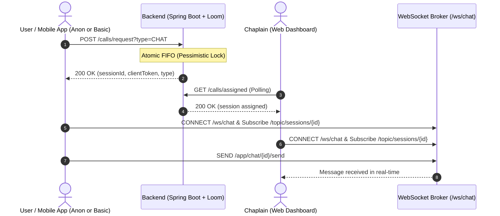

# CapellanAPP Backend: Frontend & Mobile Integration Guide

> **Architecture Note:** All REST endpoints operate over HTTP/JSON with standard status codes. Real-time written chat runs over **STOMP via WebSockets** powered by **Java 21 Virtual Threads (Project Loom)** for ultra-low latency and scalable concurrency.

---

## 1. Global Conventions & Base URLs

### Base URLs
* **REST API:** `http://localhost:8080` (or your staging/production domain, e.g. `https://api.yourdomain.com`)
* **WebSocket (STOMP):** `ws://localhost:8080/ws/chat` (or `http://localhost:8080/ws/chat` with SockJS)

### Headers
| Header | Description | Required |
| :--- | :--- | :--- |
| `Content-Type` | `application/json` | On all `POST` / `PATCH` / `PUT` requests |
| `Authorization` | `Bearer <token>` | For logged-in users (BASIC, CHAPLAIN, SUPERUSER) |
| `X-Client-Token` | `<clientToken-uuid>` | For anonymous/guest sessions and fallback reconnection |

### Rate Limiting (Anti-Abuso)
* Public/anonymous endpoints (`/calls/request`, `/calls/{id}/reconnect`, `/prayers`) allow **10 requests per minute per IP**.
* When exceeded, the backend returns:
  ```json
  // HTTP 429 Too Many Requests
  {
    "error": "Rate limit exceeded (10 requests per minute). Please wait before trying again."
  }
  ```

---

## 2. Authentication

### Default Development Seed Accounts
The backend automatically seeds and synchronizes the following development test accounts on startup (all with password `test`):
| Email / Username | Role | Default Password | Notes |
| :--- | :--- | :--- | :--- |
| `test@superuser.com` | `SUPERUSER` | `test` | Full admin rights (OFFLINE) |
| `test@chaplainleader.com` | `CHAPLAIN_LEADER` | `test` | Team lead, pastoral supervisor (OFFLINE) |
| `test@contentleader.com` | `CHAPLAIN_CONTENT_LEADER` | `test` | Multimedia & pastoral content manager (OFFLINE) |
| `test@chaplain.com` | `CHAPLAIN` | `test` | Initial status OFFLINE (switch to ONLINE via `PUT /chaplains/me/status` to receive calls) |
| `test@basic.com` | `BASIC` | `test` | Regular community user with profile (OFFLINE) |

### 2.1 Login
* **Method & Path:** `POST /auth/login`
* **Access:** Public (No token required)
* **Request Body:**
  ```json
  {
    "username": "chaplain_juan",
    "password": "SecurePassword123!"
  }
  ```
* **Response (200 OK):**
  ```json
  {
    "token": "eyJhbGciOiJIUzI1NiIsInR5cCI6IkpXVCJ9.eyJzdWIiOiJjaGFwbGFpbl9qdWFuIiwidXNlcklkIjoxNSwicm9sZSI6IkNIQVBMQUlOIiwiaWF0IjoxNzI1NDg0ODAwLCJleHAiOjE3MjU1NzEyMDB9.h2Bf8n...signature",
    "role": "CHAPLAIN" // Roles: "BASIC", "CHAPLAIN", "CHAPLAIN_LEADER", "SUPERUSER"
  }
  ```
> **JWT Specification:** The token returned is a stateless HMAC-SHA256 JWT (JSON Web Token) valid for 24 hours. Send it in all protected requests inside the `Authorization: Bearer <token>` header. Payload claims include `userId` (Long), `role` (String), `sub` (username), `iat`, and `exp`.

### 2.2 Get Current User Identity (`/auth/me`)
* **Method & Path:** `GET /auth/me`
* **Headers:** `Authorization: Bearer <token>`
* **Response (200 OK):**
  ```json
  {
    "id": 15,
    "role": "CHAPLAIN",
    "username": "chaplain_juan"
  }
  ```

---

## 3. Pastoral Sessions: Video & Written Chat



---

### 3.1 Request Pastoral Session (Video or Chat) with Pre-Call Intake Questionnaire
* **Method & Path:** `POST /calls/request`
* **Access:** **Public.** Works for both authenticated `BASIC` users (with `Authorization: Bearer <token>`) and **100% anonymous guests** (no header required).
* **Optional Query Param (Legacy):**
  * `type`: `VIDEO` (default) or `CHAT` (only needed if no JSON body is sent)
* **Request Body (Optional, Recommended):**
  ```json
  {
    "type": "VIDEO",                 // "VIDEO" (default) or "CHAT"
    "moodScore": 4,                  // Integer 1 to 5 (1 = Muy tranquilo, 5 = Muy angustiado/enojado)
    "reason": "FAMILIAR",            // Enum: "FAMILIAR", "TRABAJO", "ECONOMICO", "FE", "OTRO"
    "notes": "Necesito oracion por un problema con mi hijo", // Optional string
    "metadata": "{\"firstTime\":true}" // Optional JSON string for extensible questions without migrations
  }
  ```
* **Response (200 OK):**
  ```json
  {
    "sessionId": 104,
    "sessionType": "VIDEO",       // or "CHAT"
    "livekitRoomName": "call-e4b2d35c-1123-4556-a192-384729103847",
    "token": "eyJhbGciOi...",     // LiveKit JWT token for client (if VIDEO); null if CHAT
    "clientToken": "a1b2c3d4-e5f6-7890-1234-567890abcdef" // SAVE THIS! Essential for WS, SSE & Reconnection
  }
  ```

> [!IMPORTANT]
> **Privacy Architecture:** The caller does NOT receive their own intake back in `CallResponse` for security/leak prevention. The intake is delivered strictly to the assigned chaplain via SSE (`incoming-call`) or `GET /calls/assigned`.

---

### 3.2 Real-Time Push Notifications: Server-Sent Events (SSE)
Powered by **Java 21 Project Loom Virtual Threads**, the backend provides real-time event streams that eliminate battery-draining and high-latency HTTP polling for both chaplains and callers.

#### 3.2.1 Chaplain Incoming Call Stream (`GET /calls/sse/assigned`)
Connects the chaplain's mobile app or web dashboard to receive immediate push notifications when a caller enters their queue.

* **Method & Path:** `GET /calls/sse/assigned`
* **Authentication:**
  * Header: `Authorization: Bearer <jwt>`
  * OR Query Parameter: `?token=<jwt>` *(Recommended for standard browser `EventSource` which does not support custom headers)*
* **Connection Lifecycle:**
  * Timeout: 30 minutes (automatically reconnected by browser/client).
  * Heartbeat: Backend emits `: ping\n\n` every 25 seconds to keep NAT/firewalls and carrier connections alive.
* **Received Events:**
  1. **`connected`**: Emitted immediately upon successful connection.
     ```
     event: connected
     data: {"status":"connected","chaplainId":7}
     ```
  2. **`incoming-call`**: Emitted when a user requests a session assigned to this chaplain.
     ```
     event: incoming-call
     data: {
       "sessionId": 104,
       "sessionType": "VIDEO",
       "livekitRoomName": "call-e4b2d35c-1123-4556-a192-384729103847",
       "token": null,
       "clientToken": null,
       "intake": {
         "moodScore": 4,
         "reason": "FAMILIAR",
         "notes": "Necesito oracion por un problema con mi hijo",
         "metadata": "{\"firstTime\":true}"
       }
     }
     ```
  *When received, the chaplain client can ring, show the triage details, and call `GET /calls/assigned` to accept and retrieve the LiveKit token.*

#### 3.2.2 Caller Session Lifecycle Stream (`GET /calls/{id}/sse`)
Connects the caller (guest or registered user) to listen for session status changes in real-time instead of polling `GET /calls/{id}`.

* **Method & Path:** `GET /calls/{id}/sse`
* **Authentication:**
  * Query Parameter: `?clientToken=<clientToken>` (for anonymous guests or mobile)
  * OR Header: `X-Client-Token: <clientToken>`
  * OR Header: `Authorization: Bearer <jwt>` (for registered users)
* **Received Events:**
  1. **`connected`**: Emitted on connection establishment.
     ```
     event: connected
     data: {"status":"connected","sessionId":104}
     ```
  2. **`status-change`**: Emitted when the session transitions states (e.g. `WAITING` -> `IN_PROGRESS` when chaplain accepts, or `IN_PROGRESS` -> `ENDED` when chaplain hangs up).
     ```
     event: status-change
     data: {
       "id": 104,
       "sessionType": "VIDEO",
       "livekitRoomName": "call-e4b2d35c-1123-4556-a192-384729103847",
       "status": "IN_PROGRESS",
       "userId": null,
       "chaplainId": 7,
       "clientToken": "a1b2c3d4-e5f6-7890-1234-567890abcdef",
       "createdAt": "2026-09-14T18:00:00Z",
       "updatedAt": "2026-09-14T18:00:15Z",
       "endedAt": null
     }
     ```

---

### 3.3 Legacy Polling Fallback (100% Backwards Compatible)

#### 3.3.1 Poll Assigned Session (Chaplains only)
* **Method & Path:** `GET /calls/assigned`
* **Headers:** `Authorization: Bearer <chaplain_token>`
* **Response (200 OK - Session Found):**
  ```json
  {
    "sessionId": 104,
    "sessionType": "VIDEO",
    "livekitRoomName": "call-e4b2d35c-1123-4556-a192-384729103847",
    "token": "eyJhbGciOi...",
    "clientToken": "a1b2c3d4-e5f6-7890-1234-567890abcdef",
    "intake": {
      "moodScore": 4,
      "reason": "FAMILIAR",
      "notes": "Necesito oracion...",
      "metadata": null
    }
  }
  ```
* **Response (204 No Content):** No session currently waiting for this chaplain.

#### 3.3.2 Poll Session Details (Client / Supervisor)
* **Method & Path:** `GET /calls/{id}`
* **Headers:** `X-Client-Token: <clientToken>` (or `?clientToken=<clientToken>` or `Authorization: Bearer <token>`)
* **Response (200 OK):**
  Returns `SessionResponse`. If requested by a chaplain or superuser, the `intake` object is included; for callers, `intake` is omitted (`null`) for privacy.

---

### 3.3 Reconnection Fallback (Network / Wi-Fi Drop)
If the user's connection drops, the chaplain stays reserved in `IN_CHAT` or `IN_CALL` for a **5-minute grace period**. When the client detects network restoration, call this endpoint to resume.

* **Method & Path:** `POST /calls/{id}/reconnect`
* **Headers (either header or query param):**
  * `X-Client-Token: <clientToken>`
  * OR `?clientToken=<clientToken>`
* **Response (200 OK):**
  ```json
  {
    "sessionId": 104,
    "sessionType": "CHAT",
    "livekitRoomName": "chat-e4b2d35c-1123-4556-a192-384729103847",
    "token": null, // renewed LiveKit token if VIDEO
    "clientToken": "a1b2c3d4-e5f6-7890-1234-567890abcdef"
  }
  ```
* **Error Response (409 Conflict):** If the 5 minutes expired:
  ```json
  {
    "error": "Reconnection grace period (5 minutes) expired"
  }
  ```

---

### 3.4 Session Heartbeat (Periodic Ping)
Send this every 30-45 seconds to keep the session active and reset the disconnection timer.

* **Method & Path:** `POST /calls/{id}/heartbeat`
* **Headers:** `X-Client-Token: <clientToken>`
* **Response:** `200 OK` (empty body)

---

### 3.5 Retrieve Chat History
Call this when entering a chat room or immediately after a reconnect to recover all previous messages.

* **Method & Path:** `GET /calls/{id}/messages`
* **Headers:** `X-Client-Token: <clientToken>` (or `Authorization: Bearer <token>`)
* **Response (200 OK):**
  ```json
  [
    {
      "id": 1,
      "sessionId": 104,
      "senderRole": "GUEST",
      "senderName": "Anónimo",
      "content": "Hola, necesito hablar con alguien por favor.",
      "clientToken": null,
      "timestamp": "2026-09-04T18:00:10.123Z"
    },
    {
      "id": 2,
      "sessionId": 104,
      "senderRole": "CHAPLAIN",
      "senderName": "Capellán Pedro",
      "content": "Hola hermano, acá estoy para escucharte. ¿Cómo te sentís?",
      "clientToken": null,
      "timestamp": "2026-09-04T18:00:35.456Z"
    }
  ]
  ```

---

### 3.6 Finalizar Llamada / Sesión (`POST /calls/{id}/end`)
Finaliza la sesión de videollamada o chat y devuelve al capellán a la cola de atención.

* **Method & Path:** `POST /calls/{id}/end`
* **Headers:** `Authorization: Bearer <chaplain_token>` (o `X-Client-Token: <clientToken>`)
* **Reglas de Autorización:**
  1. **Roles Autorizados:** Únicamente el capellán asignado (`CHAPLAIN`), un líder (`CHAPLAIN_LEADER`) o un administrador (`SUPERUSER`) pueden dar por finalizada una llamada o sesión activa (`IN_PROGRESS` o `RECONNECTING`) y eliminar la sala de LiveKit.
  2. **Solicitante en Cola (Cancelación en WAITING):** Si la sesión todavía está en estado `WAITING` (en espera de ser atendida), el usuario solicitante (invocando con su `X-Client-Token` o JWT) puede cancelar su propia solicitud pendiente.
  3. **Usuarios BASIC / Invitados Anónimos:** NO tienen permisos para cerrar llamadas activas ni para destruir salas de LiveKit, garantizando que una desconexión temporal o parpadeo de red del cliente móvil no elimine la sala ni impida la reconexión.
* **Transiciones de Estado Automáticas:**
  * **Sesión:** Pasa a `status = "ENDED"`, registrando `endedAt` con el timestamp actual.
  * **Capellán:** Su estado cambia a `status = "ONLINE"` y se actualiza `enteredQueueAt = now` (vuelve a estar disponible al final de la cola FIFO para atender a un nuevo usuario).
  * **LiveKit:** La sala se elimina automáticamente en el servidor de LiveKit (`DeleteRoom`), desconectando peers residuales y liberando memoria.
* **Response (200 OK):**
  ```json
  {
    "id": 104,
    "sessionType": "VIDEO",
    "livekitRoomName": "call-e4b2d35c-1123-4556-a192-384729103847",
    "status": "ENDED",
    "userId": null,
    "chaplainId": 7,
    "clientToken": "a1b2c3d4-e5f6-7890-1234-567890abcdef",
    "createdAt": "2026-09-04T18:00:00Z",
    "updatedAt": "2026-09-04T18:15:00Z",
    "endedAt": "2026-09-04T18:15:00Z"
  }
  ```
* **Error Responses:**
  * `403 Forbidden`: `{"error": "Only the chaplain can end an active call. Sessions can only be ended by others if no one is in the room."}`
  * `404 Not Found`: `{"error": "Session not found"}`
  * `409 Conflict`: `{"error": "Session is already ended"}`

---

## 4. WebSocket (STOMP) Real-Time Chat

### Connection Details
* **STOMP Endpoint:** `ws://<BACKEND_HOST>/ws/chat` (plain WS) or `http://<BACKEND_HOST>/ws/chat` (SockJS)
* **Topic to Subscribe:** `/topic/sessions/{sessionId}`
* **Destination to Send:** `/app/chat/{sessionId}/send`

### Message Payload (Send)
When user or chaplain types a message, publish this JSON to `/app/chat/{sessionId}/send`:
```json
{
  "sessionId": 104,
  "senderRole": "GUEST",         // "GUEST", "USER", or "CHAPLAIN"
  "senderName": "Anónimo",       // Name or nickname to display
  "content": "Gracias por tus palabras, me traen mucha paz.",
  "clientToken": "a1b2c3d4-e5f6-7890-1234-567890abcdef"
}
```

### Broadcast Payload (Receive)
All subscribers on `/topic/sessions/{sessionId}` will receive:
```json
{
  "id": 3,
  "sessionId": 104,
  "senderRole": "GUEST",
  "senderName": "Anónimo",
  "content": "Gracias por tus palabras, me traen mucha paz.",
  "clientToken": null,
  "timestamp": "2026-09-04T18:05:00.789Z"
}
```

### Frontend Code Example (Web / React / Vue with `@stomp/stompjs`)
```typescript
import { Client } from '@stomp/stompjs';

const client = new Client({
  brokerURL: 'ws://localhost:8080/ws/chat',
  reconnectDelay: 3000,
  heartbeatIncoming: 10000,
  heartbeatOutgoing: 10000,
});

client.onConnect = () => {
  console.log('Connected to Chat WebSocket!');
  
  // Subscribe to the specific session room
  client.subscribe(`/topic/sessions/${sessionId}`, (message) => {
    const receivedMsg = JSON.parse(message.body);
    displayMessageInChatUI(receivedMsg);
  });
};

client.activate();

// Send message function:
function sendChatMessage(text: string) {
  client.publish({
    destination: `/app/chat/${sessionId}/send`,
    body: JSON.stringify({
      sessionId: sessionId,
      senderRole: 'GUEST',
      senderName: 'Anónimo',
      content: text,
      clientToken: storedClientToken
    })
  });
}
```

### Mobile Code Example (React Native / Flutter)
> In React Native, install `@stomp/stompjs` + `netinfo`. When the app goes into the background or detects disconnection (`NetInfo.addEventListener`), simply re-invoke `POST /calls/{id}/reconnect` and re-activate the STOMP client.

---

## 5. Community Prayer Wall (Muro de Oración)

### 5.1 Submit a Prayer Request
* **Method & Path:** `POST /prayers`
* **Access:** **Public** (Supports both registered users and anonymous visitors)
* **Rate Limit:** 10 requests / minute per IP
* **Request Body:**
  ```json
  {
    "title": "Salud para mi abuelo Ramón",
    "description": "Está internado en terapia intensiva por neumonía. Les pido que se unan en oración por su pronta recuperación.",
    "content": [
      "https://storage.googleapis.com/capellan-photos/abuelo_ramon.jpg"
    ],
    "authorName": "Lucía",       // Optional. If omitted or blank, defaults to "Anónimo"
    "isAnonymous": false        // Optional (true/false)
  }
  ```
* **Response (201 Created):**
  ```json
  {
    "id": 12,
    "title": "Salud para mi abuelo Ramón",
    "description": "Está internado en terapia intensiva por neumonía. Les pido que se unan en oración por su pronta recuperación.",
    "content": [
      "https://storage.googleapis.com/capellan-photos/abuelo_ramon.jpg"
    ],
    "authorName": "Lucía",
    "isAnonymous": false,
    "prayerCount": 0,
    "createdAt": "2026-09-04T18:10:00Z"
  }
  ```

---

### 5.2 List Prayers (Paginated)
* **Method & Path:** `GET /prayers?page=0&size=20`
* **Access:** Public
* **Query Params:**
  * `page`: 0-indexed page number (default: 0)
  * `size`: number of items per page (default: 20, max: 100)
* **Response (200 OK):**
  ```json
  {
    "content": [
      {
        "id": 12,
        "title": "Salud para mi abuelo Ramón",
        "description": "Está internado en terapia intensiva...",
        "content": [
          "https://storage.googleapis.com/capellan-photos/abuelo_ramon.jpg"
        ],
        "authorName": "Lucía",
        "isAnonymous": false,
        "prayerCount": 14,
        "createdAt": "2026-09-04T18:10:00Z"
      },
      {
        "id": 11,
        "title": "Fortaleza en este duelo",
        "description": "Pido paz en el corazón para toda mi familia en este momento tan doloroso.",
        "content": [],
        "authorName": "Anónimo",
        "isAnonymous": true,
        "prayerCount": 42,
        "createdAt": "2026-09-04T17:45:00Z"
      }
    ],
    "pageable": {
      "pageNumber": 0,
      "pageSize": 20
    },
    "totalPages": 1,
    "totalElements": 2,
    "last": true
  }
  ```

---

### 5.3 Join in Prayer ("Me uno en oración")
Increments the prayer counter for a specific prayer card.

* **Method & Path:** `POST /prayers/{id}/pray`
* **Access:** Public
* **Response (200 OK):**
  ```json
  {
    "id": 12,
    "title": "Salud para mi abuelo Ramón",
    "description": "Está internado en terapia intensiva...",
    "content": [
      "https://storage.googleapis.com/capellan-photos/abuelo_ramon.jpg"
    ],
    "authorName": "Lucía",
    "isAnonymous": false,
    "prayerCount": 15, // incremented!
    "createdAt": "2026-09-04T18:10:00Z"
  }
  ```

---

### 5.4 Post Comment on Prayer Request
Posts words of encouragement, blessings, or faith support on a prayer card.
* **Access:** **Registered Users Only** (Requires at least `BASIC` role). Anonymous guests receive `401 Unauthorized`.
* **Rate Limit:** 20 requests / minute per IP.
* **Method & Path:** `POST /prayers/{id}/comments`
* **Headers:** `Authorization: Bearer <jwt_token>`
* **Request Body:**
  ```json
  {
    "content": "Hermana Lucía, estamos clamando por la salud del abuelo Ramón desde Córdoba. Dios es fiel!"
  }
  ```
* **Response (201 Created):**
  ```json
  {
    "id": 1,
    "prayerRequestId": 12,
    "userId": 5,
    "authorName": "carlos_gomez",
    "authorRole": "BASIC",
    "content": "Hermana Lucía, estamos clamando por la salud del abuelo Ramón desde Córdoba. Dios es fiel!",
    "createdAt": "2026-09-04T18:15:30Z"
  }
  ```

---

### 5.5 List Comments for a Prayer Request
Retrieves all comments associated with a prayer request in ascending chronological order.
* **Method & Path:** `GET /prayers/{id}/comments`
* **Access:** **Public** (Both visitors and registered users can read comments)
* **Response (200 OK):**
  ```json
  [
    {
      "id": 1,
      "prayerRequestId": 12,
      "userId": 5,
      "authorName": "carlos_gomez",
      "authorRole": "BASIC",
      "content": "Hermana Lucía, estamos clamando por la salud del abuelo Ramón desde Córdoba. Dios es fiel!",
      "createdAt": "2026-09-04T18:15:30Z"
    },
    {
      "id": 2,
      "prayerRequestId": 12,
      "userId": 7,
      "authorName": "Capellán Pedro",
      "authorRole": "CHAPLAIN",
      "content": "Que la paz de Dios que sobrepasa todo entendimiento guarde sus corazones en Cristo Jesús.",
      "createdAt": "2026-09-04T18:20:00Z"
    }
  ]
  ```

---

## 6. Post-Session Reports (Chaplains & Supervisors)

> [!CAUTION]
> **Strict Confidentiality:** These endpoints are forbidden (`403 Forbidden`) to regular and anonymous users. Only the attending chaplain, supervising leader, or superuser can access them.

### 6.1 Submit Post-Session Report
* **Method & Path:** `POST /calls/{id}/report`
* **Headers:** `Authorization: Bearer <chaplain_token>`
* **Request Body:**
  ```json
  {
    "subject": "Acompañamiento por duelo familiar",
    "category": "SPIRITUAL_COUNSELING", // Enum: SPIRITUAL_COUNSELING, EMOTIONAL_CRISIS, PRAYER_REQUEST, OTHER
    "severity": 2,                      // 1 (Mild) to 5 (Emergency/Crisis)
    "summary": "Se conversó y oró por la pérdida de un familiar. El usuario se retiró en calma."
  }
  ```
* **Response (201 Created):**
  ```json
  {
    "id": 8,
    "sessionId": 104,
    "subject": "Acompañamiento por duelo familiar",
    "category": "SPIRITUAL_COUNSELING",
    "severity": 2,
    "summary": "Se conversó y oró por la pérdida de un familiar...",
    "createdBy": 7,
    "createdAt": "2026-09-04T18:20:00Z"
  }
  ```

### 6.2 Read Report
* **Method & Path:** `GET /calls/{id}/report`
* **Headers:** `Authorization: Bearer <token>`
* **Response:** `200 OK` with the report payload.

---

## 7. Chaplain Team Directory & Profiles

### 7.1 Public Chaplain Team Directory ("Conocé a nuestro equipo")
Public endpoint to list the chaplaincy team. Displays their background, military/security force, service years, rank, bio, and avatar.

* **Method & Path:** `GET /chaplains/team`
* **Access:** **Public** (No token required)
* **Response (200 OK):**
  ```json
  [
    {
      "userId": 7,
      "username": "chaplain_pedro",
      "fullName": "Capellán Pedro Morales",
      "militaryForce": "GENDARMERIA", // Enum: EJERCITO, ARMADA, FUERZA_AEREA, GENDARMERIA, PREFECTURA, POLICIA_FEDERAL, POLICIA_PROVINCIAL, POLICIA_DE_LA_CIUDAD, SERVICIO_PENITENCIARIO, OTRA
      "yearsOfService": 16,
      "isActiveInForce": true,        // true = en actividad, false = retirado
      "militaryRank": "Comandante Principal",
      "bio": "Acompañamiento en zonas de frontera y contención en situaciones de crisis familiar y estrés post-traumático.",
      "avatarUrl": "https://storage.googleapis.com/capellan-photos/pedro.jpg",
      "role": "CHAPLAIN",
      "status": "ONLINE"
    }
  ]
  ```

---

### 7.2 View Specific Chaplain Profile
* **Method & Path:** `GET /chaplains/{id}/profile`
* **Access:** **Public**
* **Response (200 OK):**
  ```json
  {
    "userId": 7,
    "username": "chaplain_pedro",
    "fullName": "Capellán Pedro Morales",
    "militaryForce": "GENDARMERIA",
    "yearsOfService": 16,
    "isActiveInForce": true,
    "militaryRank": "Comandante Principal",
    "bio": "Acompañamiento en zonas de frontera...",
    "avatarUrl": "https://storage.googleapis.com/capellan-photos/pedro.jpg",
    "updatedAt": "2026-09-09T18:00:00Z"
  }
  ```

---

### 7.3 Update Chaplain Service Profile
Restricted to authenticated chaplains and leaders.

* **Method & Path:** `PUT /profiles/chaplain`
* **Headers:** `Authorization: Bearer <chaplain_token>`
* **Request Body:**
  ```json
  {
    "fullName": "Capellán Mayor Pedro Morales",
    "militaryForce": "GENDARMERIA",
    "yearsOfService": 17,
    "isActiveInForce": true,
    "militaryRank": "Comandante Mayor",
    "bio": "Especialista en contención familiar y trauma.",
    "avatarUrl": "https://storage.googleapis.com/capellan-photos/pedro_v2.jpg"
  }
  ```
* **Response (200 OK):** Returns the updated `ChaplainProfileResponse`.

---

### 7.4 Get Current Basic User Profile
* **Method & Path:** `GET /profiles/basic/me`
* **Headers:** `Authorization: Bearer <token>`
* **Response (200 OK):**
  ```json
  {
    "userId": 15,
    "username": "lucas_gomez",
    "fullName": "Lucas Gómez",
    "isAnonymous": false,
    "phone": "+5491122334455",
    "location": "Córdoba, Argentina",
    "updatedAt": "2026-09-09T18:10:00Z"
  }
  ```

---

### 7.5 Update Basic User Profile & Anonymity Privacy Toggle
Allows the user to set their personal details and toggle whether they prefer their identity to be masked in pastoral interactions.

* **Method & Path:** `PUT /profiles/basic/me`
* **Headers:** `Authorization: Bearer <token>`
* **Request Body:**
  ```json
  {
    "fullName": "Lucas Gómez",
    "isAnonymous": true, // Mask identity in sessions and prayers
    "phone": "+5491122334455",
    "location": "Córdoba, Argentina"
  }
  ```
* **Response (200 OK):** Returns the updated `BasicProfileResponse`.

---

## 8. Multimedia Content & Likes (CRUD & Social Interactions)

This module allows pastoral leaders with role `CHAPLAIN_CONTENT_LEADER` (or `SUPERUSER`) to publish and manage uplifting pastoral multimedia contents (Spotify episodes, YouTube reflections, images, video links) for community members. Any registered user can toggle likes on these posts.

### 8.1 Content Types
| Type | Description |
| :--- | :--- |
| `SPOTIFY` | Audio podcasts, devocionales or sermons hosted on Spotify |
| `YOUTUBE` | Video links or live streams hosted on YouTube |
| `IMAGE` | Devotional images, verses, announcements, infographics |
| `VIDEO` | Direct video URLs or external video platforms |

---

### 8.2 List Content (Feed / Catalog)
Public feed of all published content, optionally filtered by `type`. If called with an `Authorization: Bearer <token>` header, the `isLikedByMe` boolean will accurately indicate whether the logged-in user liked each item. If unauthenticated, `isLikedByMe` returns `null`.

* **Method & Path:** `GET /contents`
* **Query Parameters (Optional):**
  * `type`: Enum filter (`SPOTIFY`, `YOUTUBE`, `IMAGE`, `VIDEO`)
* **Headers:** `Authorization: Bearer <token>` *(Optional)*
* **Response (200 OK):**
  ```json
  [
    {
      "id": 1,
      "title": "Paz en la Tormenta",
      "description": "Reflexión bíblica para sobrellevar momentos de incertidumbre laboral y familiar.",
      "mediaUrl": "https://open.spotify.com/episode/5123abcd...",
      "type": "SPOTIFY",
      "authorId": 18,
      "likesCount": 24,
      "isLikedByMe": true,
      "createdAt": "2026-09-14T21:00:00Z",
      "updatedAt": "2026-09-14T21:00:00Z"
    },
    {
      "id": 2,
      "title": "Oración Matutina",
      "description": "Video devocional para arrancar la semana con fe y esperanza.",
      "mediaUrl": "https://www.youtube.com/watch?v=dQw4w9WgXcQ",
      "type": "YOUTUBE",
      "authorId": 18,
      "likesCount": 8,
      "isLikedByMe": false,
      "createdAt": "2026-09-14T22:30:00Z",
      "updatedAt": "2026-09-14T22:30:00Z"
    }
  ]
  ```

---

### 8.3 Get Content Details by ID
Public endpoint to view single content details.

* **Method & Path:** `GET /contents/{id}`
* **Headers:** `Authorization: Bearer <token>` *(Optional)*
* **Response (200 OK):**
  ```json
  {
    "id": 1,
    "title": "Paz en la Tormenta",
    "description": "Reflexión bíblica para sobrellevar momentos de incertidumbre laboral y familiar.",
    "mediaUrl": "https://open.spotify.com/episode/5123abcd...",
    "type": "SPOTIFY",
    "authorId": 18,
    "likesCount": 24,
    "isLikedByMe": true,
    "createdAt": "2026-09-14T21:00:00Z",
    "updatedAt": "2026-09-14T21:00:00Z"
  }
  ```
* **Errors:**
  * `404 Not Found`: If no content exists with the provided ID (`{"error": "Content not found"}`).

---

### 8.4 Create Content
Creates a new multimedia publication. Restricted to `CHAPLAIN_CONTENT_LEADER` and `SUPERUSER`.

* **Method & Path:** `POST /contents`
* **Headers:**
  * `Authorization: Bearer <token>` *(Required)*
  * `Content-Type: application/json`
* **Request Body:**
  ```json
  {
    "title": "Paz en la Tormenta",
    "description": "Reflexión bíblica para sobrellevar momentos de incertidumbre laboral y familiar.",
    "mediaUrl": "https://open.spotify.com/episode/5123abcd...",
    "type": "SPOTIFY"
  }
  ```
* **Response (201 Created):** Returns the created `ContentResponseDto` (with `likesCount: 0` and `isLikedByMe: false`).
* **Errors:**
  * `400 Bad Request`: Validation failure (missing required title/description/mediaUrl/type or invalid type enum).
  * `401 Unauthorized`: Missing or invalid Bearer token.
  * `403 Forbidden`: User is authenticated but lacks `CHAPLAIN_CONTENT_LEADER` or `SUPERUSER` role.

---

### 8.5 Update Content
Updates existing content. Restricted to `CHAPLAIN_CONTENT_LEADER` and `SUPERUSER`.

* **Method & Path:** `PUT /contents/{id}`
* **Headers:**
  * `Authorization: Bearer <token>` *(Required)*
  * `Content-Type: application/json`
* **Request Body:**
  ```json
  {
    "title": "Paz en la Tormenta (Edición Renovada)",
    "description": "Versión extendida con oración final.",
    "mediaUrl": "https://open.spotify.com/episode/5123abcd...",
    "type": "SPOTIFY"
  }
  ```
* **Response (200 OK):** Returns the updated `ContentResponseDto`.
* **Errors:**
  * `403 Forbidden`: Caller lacks leader permissions.
  * `404 Not Found`: Content with ID does not exist.

---

### 8.6 Delete Content
Permanently removes content and cleans up all associated likes. Restricted to `CHAPLAIN_CONTENT_LEADER` and `SUPERUSER`.

* **Method & Path:** `DELETE /contents/{id}`
* **Headers:** `Authorization: Bearer <token>` *(Required)*
* **Response (204 No Content):** Empty body.
* **Errors:**
  * `403 Forbidden`: Caller lacks leader permissions.
  * `404 Not Found`: Content does not exist.

---

### 8.7 Toggle Like (Like / Unlike)
Allows any authenticated user (`BASIC`, `CHAPLAIN`, `SUPERUSER`, etc.) to like or remove their like from a content item in a single atomic action.

* **Method & Path:** `POST /contents/{id}/like`
* **Headers:** `Authorization: Bearer <token>` *(Required)*
* **Request Body:** None
* **Response (200 OK):**
  ```json
  {
    "contentId": 1,
    "likesCount": 25,
    "liked": true
  }
  ```
* **Errors:**
  * `401 Unauthorized`: Unauthenticated caller.
  * `404 Not Found`: Content with provided ID not found.

---

## 9. Community Blogs & Reflections (CRUD, Tags, Likes, Shares & Comments)

This module allows community members (including `BASIC` users) and pastoral staff to publish blogs, testimonies, combat stories, and spiritual reflections. Posts are **strictly non-anonymous** (author name and role are attached and displayed).

### Permissions & Rules:
* **Creation (`POST /blogs`)**: Any authenticated user (`BASIC`, `CHAPLAIN`, `CHAPLAIN_LEADER`, `CHAPLAIN_CONTENT_LEADER`, `SUPERUSER`).
* **Editing (`PUT /blogs/{id}`)**: Author of the post or `SUPERUSER`.
* **Deletion (`DELETE /blogs/{id}`)**: The **original author** (including `BASIC`), OR pastoral moderation staff (`CHAPLAIN`, `CHAPLAIN_LEADER`, `CHAPLAIN_CONTENT_LEADER`, `SUPERUSER`).
* **Public Reading (`GET /blogs`, `GET /blogs/{idOrSlug}`)**: Anyone (authenticated or guest).
* **Interactions**:
  * **Likes (`POST /blogs/{id}/like`)**: Any authenticated user (atomic toggle).
  * **Shares (`POST /blogs/{id}/share`)**: Publicly accessible, increments share counter and returns SEO shareable path.
  * **Comments (`POST /blogs/{id}/comments`)**: Any authenticated user (non-anonymous).

---

### 9.1 Initial Predefined Tags
The backend automatically seeds the following tags on startup:
| Tag Name | Slug |
| :--- | :--- |
| `anecdota` | `anecdota` |
| `descargo` | `descargo` |
| `espiritual` | `espiritual` |
| `reflexion` | `reflexion` |
| `historia de combate` | `historia-de-combate` |
| `predica` | `predica` |
| `testimonio` | `testimonio` |

---

### 9.2 List Blogs (Paginated Feed)
Public feed of blog posts, sorted by newest first. Supports pagination and filtering by tag slug. If called with `Authorization: Bearer <token>`, `isLikedByMe` reflects whether the caller liked each post (`null` if unauthenticated).

* **Method & Path:** `GET /blogs`
* **Query Parameters (Optional):**
  * `tag`: Tag slug (e.g., `espiritual`, `testimonio`)
  * `page`: Page index (default: `0`)
  * `size`: Page size (default: `10`, max: `50`)
* **Headers:** `Authorization: Bearer <token>` *(Optional)*
* **Response (200 OK):**
  ```json
  {
    "content": [
      {
        "id": 1,
        "slug": "la-fe-en-el-frente-de-combate",
        "title": "La Fe en el Frente de Combate",
        "summary": "Una reflexión sobre cómo mantener la calma y la oración en los momentos más difíciles.",
        "authorId": 10,
        "authorName": "Sargento Marcos Gómez",
        "authorRole": "BASIC",
        "tags": [
          {
            "id": 5,
            "name": "historia de combate",
            "slug": "historia-de-combate"
          },
          {
            "id": 3,
            "name": "espiritual",
            "slug": "espiritual"
          }
        ],
        "likesCount": 18,
        "sharesCount": 5,
        "commentsCount": 3,
        "isLikedByMe": true,
        "createdAt": "2026-09-16T14:30:00Z"
      }
    ],
    "page": {
      "size": 10,
      "number": 0,
      "totalElements": 1,
      "totalPages": 1
    }
  }
  ```

---

### 9.3 Get Blog Post Details by ID or Slug
Public endpoint supporting deep-linking either via numerical ID (`/blogs/1`) or SEO-friendly slug (`/blogs/la-fe-en-el-frente-de-combate`).

* **Method & Path:** `GET /blogs/{idOrSlug}`
* **Headers:** `Authorization: Bearer <token>` *(Optional)*
* **Response (200 OK):**
  ```json
  {
    "id": 1,
    "slug": "la-fe-en-el-frente-de-combate",
    "title": "La Fe en el Frente de Combate",
    "summary": "Una reflexión sobre cómo mantener la calma y la oración en los momentos más difíciles.",
    "content": "Texto completo del blog con formato markdown o texto plano...",
    "authorId": 10,
    "authorName": "Sargento Marcos Gómez",
    "authorRole": "BASIC",
    "tags": [
      {
        "id": 5,
        "name": "historia de combate",
        "slug": "historia-de-combate"
      }
    ],
    "likesCount": 18,
    "sharesCount": 5,
    "commentsCount": 3,
    "isLikedByMe": true,
    "createdAt": "2026-09-16T14:30:00Z",
    "updatedAt": "2026-09-16T14:30:00Z"
  }
  ```
* **Errors:** `404 Not Found` (`{"error": "Blog post not found"}`).

---

### 9.4 Create Blog Post
Creates a new blog post. Requires authentication. Author name and role are automatically captured from the session.

* **Method & Path:** `POST /blogs`
* **Headers:**
  * `Authorization: Bearer <token>` *(Required)*
  * `Content-Type: application/json`
* **Request Body:**
  ```json
  {
    "title": "La Fe en el Frente de Combate",
    "summary": "Resumen opcional. Si se omite, se genera de los primeros 200 caracteres.",
    "content": "Texto completo de la anécdota o reflexión...",
    "tagSlugs": ["historia-de-combate", "espiritual"]
  }
  ```
* **Response (201 Created):** Returns full `BlogPostResponseDto` with `likesCount: 0`, `sharesCount: 0`, `commentsCount: 0`, `isLikedByMe: false`.
* **Errors:**
  * `400 Bad Request`: Validation failure (empty title or content).
  * `401 Unauthorized`: Unauthenticated.

---

### 9.5 Update Blog Post
Updates title, summary, content, and/or tags. Restricted to original author or `SUPERUSER`.

* **Method & Path:** `PUT /blogs/{id}`
* **Headers:**
  * `Authorization: Bearer <token>` *(Required)*
  * `Content-Type: application/json`
* **Request Body:**
  ```json
  {
    "title": "La Fe en el Frente de Combate (Edición Revisada)",
    "summary": "Resumen actualizado.",
    "content": "Contenido corregido y ampliado...",
    "tagSlugs": ["historia-de-combate", "testimonio"]
  }
  ```
* **Response (200 OK):** Returns updated `BlogPostResponseDto`.
* **Errors:**
  * `403 Forbidden`: User is not the author nor a `SUPERUSER`.
  * `404 Not Found`: Blog post does not exist.

---

### 9.6 Delete Blog Post
Deletes a blog post and cascades deletion of its likes and comments. Allowed for:
1. The **original author** (including `BASIC` role).
2. Pastoral moderation staff (`CHAPLAIN`, `CHAPLAIN_LEADER`, `CHAPLAIN_CONTENT_LEADER`, `SUPERUSER`).

* **Method & Path:** `DELETE /blogs/{id}`
* **Headers:** `Authorization: Bearer <token>` *(Required)*
* **Response (204 No Content):** Empty body.
* **Errors:**
  * `403 Forbidden`: Caller is not the author and lacks moderation privileges.
  * `404 Not Found`: Post does not exist.

---

### 9.7 Toggle Like on Blog Post
Atomically likes or unlikes a blog post.

* **Method & Path:** `POST /blogs/{id}/like`
* **Headers:** `Authorization: Bearer <token>` *(Required)*
* **Response (200 OK):**
  ```json
  {
    "blogId": 1,
    "likesCount": 19,
    "liked": true // true if like added, false if removed
  }
  ```

---

### 9.8 Share Blog Post
Publicly accessible. Atomically increments `sharesCount` and returns the canonical shareable slug URL.

* **Method & Path:** `POST /blogs/{id}/share`
* **Response (200 OK):**
  ```json
  {
    "blogId": 1,
    "sharesCount": 6,
    "shareUrl": "/blogs/la-fe-en-el-frente-de-combate"
  }
  ```

---

### 9.9 List Comments on Blog Post
Publicly readable chronological comments for a post.

* **Method & Path:** `GET /blogs/{id}/comments`
* **Response (200 OK):**
  ```json
  [
    {
      "id": 1,
      "blogId": 1,
      "userId": 15,
      "authorName": "Capellán Juan Perez",
      "authorRole": "CHAPLAIN",
      "content": "Fuerza hermano, Dios siempre está en la trinchera con nosotros.",
      "createdAt": "2026-09-16T15:00:00Z"
    }
  ]
  ```

---

### 9.10 Add Comment to Blog Post
Non-anonymous comment.

* **Method & Path:** `POST /blogs/{id}/comments`
* **Headers:**
  * `Authorization: Bearer <token>` *(Required)*
  * `Content-Type: application/json`
* **Request Body:**
  ```json
  {
    "content": "Fuerza hermano, Dios siempre está en la trinchera con nosotros."
  }
  ```
* **Response (201 Created):** Returns `BlogCommentResponseDto`.

---

### 9.11 Delete Comment
Allowed for the comment author or pastoral moderators.

* **Method & Path:** `DELETE /blogs/comments/{commentId}`
* **Headers:** `Authorization: Bearer <token>` *(Required)*
* **Response (204 No Content):** Empty body.
* **Errors:** `403 Forbidden`, `404 Not Found`.

---

### 9.12 List All Tags
Public endpoint listing all available categories.

* **Method & Path:** `GET /blogs/tags`
* **Response (200 OK):**
  ```json
  [
    {
      "id": 1,
      "name": "anecdota",
      "slug": "anecdota"
    },
    {
      "id": 2,
      "name": "descargo",
      "slug": "descargo"
    },
    {
      "id": 3,
      "name": "espiritual",
      "slug": "espiritual"
    }
  ]
  ```

---

### 9.13 Create Tag (Pastoral Content Leader Only)
Restricted to `CHAPLAIN_CONTENT_LEADER` and `SUPERUSER`.

* **Method & Path:** `POST /blogs/tags`
* **Headers:**
  * `Authorization: Bearer <token>` *(Required)*
  * `Content-Type: application/json`
* **Request Body:**
  ```json
  {
    "name": "misión de paz"
  }
  ```
* **Response (201 Created):**
  ```json
  {
    "id": 8,
    "name": "misión de paz",
    "slug": "mision-de-paz"
  }
  ```

---

### 9.14 Drafts & Auto-Save Buffer (Borradores)
Permite al autor ir escribiendo su publicación de a poco, con guardado automático periódico (o ante cierre de ventana / cambio de pestaña) para que nunca se pierda el progreso. Cada usuario tiene exactamente **un buffer de borrador activo** que es estrictamente privado.

#### 9.14.1 Get Active Draft
Obtiene el borrador guardado del usuario actual.

* **Method & Path:** `GET /blogs/draft`
* **Headers:** `Authorization: Bearer <token>` *(Required)*
* **Response (200 OK):**
  ```json
  {
    "id": 1,
    "userId": 10,
    "postId": null,
    "title": "Mi borrador en progreso",
    "summary": "Breve resumen preliminar...",
    "content": "Estoy redactando este testimonio poco a poco...",
    "tagSlugs": ["espiritual", "testimonio"],
    "updatedAt": "2026-09-16T19:30:00Z"
  }
  ```
* **Response (204 No Content):** Si el usuario no tiene ningún borrador guardado.

#### 9.14.2 Auto-Save / Update Draft (Upsert)
Crea o actualiza el borrador del usuario. Acepta campos parciales o vacíos para que el editor pueda auto-guardar en caliente sin errores de validación.

* **Method & Path:** `PUT /blogs/draft`
* **Headers:**
  * `Authorization: Bearer <token>` *(Required)*
  * `Content-Type: application/json`
* **Request Body:**
  ```json
  {
    "postId": null,
    "title": "Mi borrador en progreso",
    "summary": "Breve resumen...",
    "content": "Texto del blog...",
    "tagSlugs": ["espiritual", "testimonio"]
  }
  ```
  *(Nota: Si `postId` tiene un ID numérico, indica que se está redactando un borrador de edición sobre un post ya publicado. Si es `null`, es una publicación nueva).*
* **Response (200 OK):** Devuelve el objeto `BlogDraftDto` actualizado con su marca de tiempo `updatedAt`.

#### 9.14.3 Discard Draft
Elimina/descarta el borrador activo del usuario.

* **Method & Path:** `DELETE /blogs/draft`
* **Headers:** `Authorization: Bearer <token>` *(Required)*
* **Response (204 No Content):** Cuerpo vacío.

#### 9.14.4 Publish Draft
Publica el borrador activo como un post oficial en el feed público (creando uno nuevo o actualizando el post existente si tenía `postId`) y limpia automáticamente el buffer de borrador.

* **Method & Path:** `POST /blogs/draft/publish`
* **Headers:** `Authorization: Bearer <token>` *(Required)*
* **Response (201 Created):** Devuelve el `BlogPostResponseDto` completo publicado.
* **Errors:**
  * `400 Bad Request`: Si el borrador no tiene título o contenido al momento de publicar, o si no existe un borrador activo.

---

## 10. Biblia PDDPT & Perlita del Día

> **Traducción Oficial:** *Palabra de Dios para Ti (PDDPT)* — © 2020 Asociación Bíblica Latinoamericana. Licencia Creative Commons Atribución 4.0 Internacional (CC BY 4.0). Distribución oficial: [eBible.org](https://ebible.org/spapddpt/).
> **Acceso:** Público (No requiere token JWT de autenticación).
> **Prefijos soportados:** Tanto `/api/perlita` como `/perlita`, y `/api/bible` como `/bible`.

---

### 10.1 Perlita del Día

#### 10.1.1 Obtener la Perlita del Día (Determinística)
Devuelve el versículo devocional diario asignado a la fecha consultada. Todos los usuarios y dispositivos reciben exactamente la misma perlita durante el día, cambiando automáticamente a medianoche sin necesidad de procesos programados (cron jobs) ni llamadas a IA.

* **Method & Path:** `GET /api/perlita/del-dia` (o `GET /perlita/del-dia`)
* **Query Parameters (Opcional):**
  * `date`: `YYYY-MM-DD` (ej. `2026-09-22`). Si se omite, toma la fecha actual del servidor.
* **Response (200 OK):**
  ```json
  {
    "date": "2026-09-22",
    "translation": "PDDPT",
    "reference": "Salmos 23:1",
    "text": "Yavé es mi Pastor. Nada me faltará.",
    "book": "Salmos",
    "bookCode": "PSA",
    "chapter": 23,
    "verse": "1",
    "attribution": "Palabra de Dios para ti © 2020 Asociación Bíblica Latinoamericana (CC BY 4.0) via eBible.org"
  }
  ```

#### 10.1.2 Obtener Perlita Aleatoria
Devuelve un versículo devocional aleatorio del canon bíblico PDDPT, independiente de la fecha.

* **Method & Path:** `GET /api/perlita/random` (o `GET /perlita/random`)
* **Response (200 OK):** Mismo formato que la Perlita del Día.

---

### 10.2 Consulta Bíblica Online

#### 10.2.1 Metadatos y Licencia de la Traducción
* **Method & Path:** `GET /api/bible/metadata` (o `GET /bible/metadata`)
* **Response (200 OK):**
  ```json
  {
    "translation": "PDDPT",
    "name": "Palabra de Dios para ti",
    "nameEnglish": "Spanish Bible (God's Word for You)",
    "language": "es",
    "version": "1.0",
    "attribution": "Palabra de Dios para ti © 2020 Asociación Bíblica Latinoamericana. Licencia CC BY 4.0. eBible.org",
    "sourceUrl": "https://ebible.org/spapddpt/",
    "totalBooks": 66,
    "totalVerses": 31081
  }
  ```

#### 10.2.2 Listado de Libros Canónicos
Lista los 66 libros en orden canónico con totales de capítulos y versículos.

* **Method & Path:** `GET /api/bible/books`
* **Response (200 OK):**
  ```json
  [
    {
      "code": "GEN",
      "name": "Génesis",
      "shortName": "Génesis",
      "longName": "Génesis",
      "abbr": "Gn",
      "testament": "OT",
      "order": 1,
      "totalChapters": 50,
      "totalVerses": 1533
    },
    ...
    {
      "code": "PSA",
      "name": "Salmos",
      "shortName": "Salmos",
      "longName": "Salmos",
      "abbr": "Sal",
      "testament": "OT",
      "order": 19,
      "totalChapters": 150,
      "totalVerses": 2527
    },
    ...
    {
      "code": "REV",
      "name": "Apocalipsis",
      "shortName": "Apocalipsis",
      "longName": "Apocalipsis",
      "abbr": "Ap",
      "testament": "NT",
      "order": 66,
      "totalChapters": 22,
      "totalVerses": 404
    }
  ]
  ```

#### 10.2.3 Detalle de un Libro
Acepta código (`PSA`), abreviatura (`Sal`) o nombre en español (`Salmos`, insensible a acentos/mayúsculas).

* **Method & Path:** `GET /api/bible/books/{book}` (ej. `/api/bible/books/PSA` o `/api/bible/books/Salmos`)
* **Response (200 OK):** Objeto del libro con sus metadatos y lista de capítulos.

#### 10.2.4 Versículos de un Capítulo
* **Method & Path:** `GET /api/bible/books/{book}/chapters/{chapter}` (ej. `/api/bible/books/PSA/chapters/23`)
* **Response (200 OK):**
  ```json
  {
    "chapter": 23,
    "totalVerses": 6,
    "verses": [
      {
        "verse": "1",
        "text": "Yavé es mi Pastor. Nada me faltará.",
        "reference": "Salmos 23:1",
        "bookCode": "PSA",
        "bookName": "Salmos",
        "chapter": 23
      },
      ...
    ]
  }
  ```

#### 10.2.5 Versículo Específico
* **Method & Path:** `GET /api/bible/books/{book}/chapters/{chapter}/verses/{verse}` (ej. `/api/bible/books/PSA/chapters/23/verses/1`)
* **Response (200 OK):**
  ```json
  {
    "verse": "1",
    "text": "Yavé es mi Pastor. Nada me faltará.",
    "reference": "Salmos 23:1",
    "bookCode": "PSA",
    "bookName": "Salmos",
    "chapter": 23
  }
  ```

#### 10.2.6 Búsqueda Textual en las Escrituras
Búsqueda insensible a mayúsculas y acentos.

* **Method & Path:** `GET /api/bible/search?q={texto}&testament={OT|NT}&limit={limite}`
* **Query Parameters:**
  * `q`: Término a buscar (ej. `pastor` o `paz`) *(Requerido)*
  * `testament`: Opcional (`OT` para Antiguo Testamento, `NT` para Nuevo Testamento)
  * `limit`: Límite de resultados (default: 50, máx: 200)
* **Response (200 OK):**
  ```json
  {
    "query": "pastor",
    "testament": "OT",
    "totalMatches": 20,
    "results": [
      {
        "verse": "1",
        "text": "Yavé es mi Pastor. Nada me faltará.",
        "reference": "Salmos 23:1",
        "bookCode": "PSA",
        "bookName": "Salmos",
        "chapter": 23
      }
    ]
  }
  ```

---

### 10.3 Descarga para Uso Offline en Mobile

Diseñado específicamente para que la app mobile descargue la Biblia completa en su primer inicio y la almacene en SQLite local (Room / Hive / CoreData / WatermelonDB), permitiendo lectura y consulta devocional sin conexión a internet.

* **Method & Path:** `GET /api/bible/download` (o `GET /bible/download`)
* **HTTP Headers de Optimización:**
  * `Accept-Encoding: gzip`: El backend comprime automáticamente el payload de 4.3 MB a tan solo **~1.28 MB** sobre la red.
  * `If-None-Match: "pddpt-v1.0"`: La app mobile debe almacenar el `ETag` recibido en la primera descarga. Si envía `If-None-Match`, el servidor responde `304 Not Modified` con cuerpo vacío, ahorrando 100% de datos si la traducción ya está al día.
  * Cabecera de respuesta: `Cache-Control: public, max-age=31536000, immutable`.
* **Estructura devuelta (200 OK):**
  ```json
  {
    "translation": "PDDPT",
    "name": "Palabra de Dios para ti",
    "nameEnglish": "Spanish Bible (God's Word for You)",
    "language": "es",
    "version": "1.0",
    "attribution": "Palabra de Dios para ti © 2020 Asociación Bíblica Latinoamericana. Licencia CC BY 4.0. eBible.org",
    "sourceUrl": "https://ebible.org/spapddpt/",
    "totalBooks": 66,
    "totalVerses": 31081,
    "books": [
      {
        "code": "GEN",
        "name": "Génesis",
        "shortName": "Génesis",
        "longName": "Génesis",
        "abbr": "Gn",
        "testament": "OT",
        "order": 1,
        "totalChapters": 50,
        "totalVerses": 1533,
        "chapters": [
          {
            "chapter": 1,
            "totalVerses": 31,
            "verses": [
              {
                "verse": "1",
                "text": "En un principio ʼElohim creó los cielos y la tierra.",
                "reference": "Génesis 1:1",
                "bookCode": "GEN",
                "bookName": "Génesis",
                "chapter": 1
              }
            ]
          }
        ]
      }
    ]
  }
  ```

---

## 11. Quick Troubleshooting & Status Codes

| HTTP Status | Reason | What the Frontend / Mobile Should Do |
| :--- | :--- | :--- |
| `200 OK / 201 Created` | Success | Process data normally |
| `401 Unauthorized` | Invalid/expired session token | Redirect to login screen (unless it's an anonymous guest flow) |
| `403 Forbidden` | Insufficient permissions | Alert user: "No tenés permisos para esta acción" |
| `404 Not Found` | Session, chaplain, profile, prayer, or blog not found | Verify the ID passed in the path |
| `409 Conflict` | Reconnection grace period expired, duplicate report, or concurrent update | Inform user or retry operation |
| `429 Too Many Requests`| Rate limit exceeded (10 calls/min) | Show temporary alert: "Demasiadas peticiones. Aguardá unos segundos." |
| `500 Server Error` | Unhandled error | Generic error fallback |


