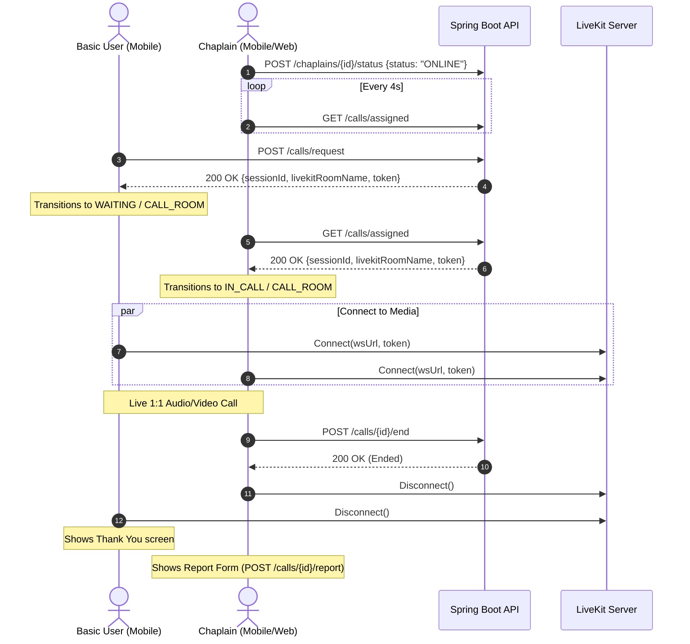

# Design: Mobile Architecture & Screen Flow

## 1. Sequence Diagram: Call Flow

## 2. State Management Architecture
A lightweight, high-performance in-memory store is used for state synchronization:
- `authStore`: User identity (`userId`, `username`, `role`), opaque session token, login/logout actions.
- `callStore`: Active session metadata (`sessionId`, `livekitRoomName`, `token`), call status (`IDLE`, `REQUESTING`, `WAITING`, `IN_PROGRESS`, `ENDED`), error handling (including friendly 404 chaplain unavailable state).
- `chaplainStore`: Chaplain duty status (`ONLINE`, `OFFLINE`, `IN_CALL`), assigned call polling state.
